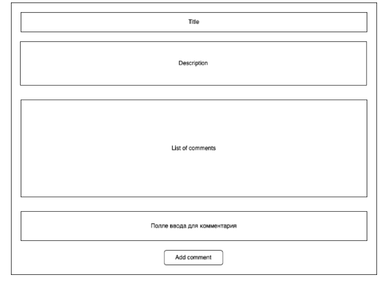

Задание:
Использовать fetch с async await для получения данных. Для организации кода используйте js class.
При загрузке страницы нужно вывести информацию по первому посту (из коллекции posts) и все комментарии которые относятся к данному посту.
Для отображении информации используйте макет.

Опциональное задание. Реализовать возможность добавлять комментарии к данному посту.
Опциональное задание. Следующий код выводит логи в следующей последовательности 1 5 4 3 2. Необходимо поправить код таким образом чтобы выводил результат в следующей последовательности 1 5 3 4 2.

console.log(1);

setTimeout(function () {
console.log(2);
}, 100);

setTimeout(function () {
console.log(3);
}, 0);

new Promise(function (resolve) {
resolve();
}).then(() => {
console.log(4);
});

console.log(5);
 
